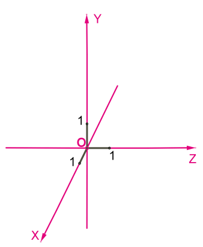

# Packy📦


3D Bin Packing Algorithm, based on [AB-AFIT](doc/AirForceBinPacking.pdf) with some changes for a specific task. 

Special for *Hack In Home* Hackathon 2020, KSU MSTU Stankin.

Track: from Partner *BoschRexroth*.


## Features

- Modified EB-AFIT Pallet Loading Algorithm (No box flip on the side or upside down, support SKU and limited weight support )
- Simple *JSON* export for robots🤖 and *Excel* document for human👷🏽
- **No **platform dependencies
- **No **dependence on third-party libraries
- **No **dependencies on the compiler (library *C* code can be compiled by any compiler)

## Usage

*Packy* hasn't installation version, just script launch. And supports **only** Python 3.

> If you want to use x64 version of lib, delete from dll name "64" or change it in python script

Put the `box.txt` file with the format content into the script folder:

```
Pallet_X, Pallet_Y, Pallet_Z
SKU_NUM BOX_X, BOX_Y, BOX_Z, BOX_WEIGHT, BOX_COUNT
...
```

`Pallet_(XYZ)` - size of pallet (<5 symbols)

`SKU_NUM` - SKU in database (7 symbols)

`BOX_(XYZ)` - size of box (<5 symbols)

`BOX_WEIGHT` - weight of one box with that SKU (<5 symbols)

`BOX_COUNT` - number of boxes to be packed (<5 symbols)

> **Note**: The Y-axis is directed upwards from the plane of the pallet floor.



**Example:**

```
111, 112, 113
SKU1231 70, 104, 24, 9000, 20
SKU7682 14, 104, 48, 2000, 10
SKU5723 40, 52, 37, 500, 10
SKU7777 58, 13, 89, 2000, 5
SKU4432 12, 13, 44, 890, 6
```

----

### Windows

```
python packy.py
```

> All `.dll` already precompiled, but you may do it [yourself](#compile-library). Not support  `.so` now :(  

Linux now is not tested, but you may try it by pre-compiling the library

### Linux

```
python3 packy.py
```

----

#### Result

The result of the program will be the creation of Excel reports in the *Report* folder for humans, as well as the creation of .~3d reports for robots in *Robot* folder. 

## Project structure

```
Packy:
│   Presentation.pdf
│   README.pdf
│
├───c_lib                            // C lib VS2019 project folder
│   │   3d_packer.sln
│   │   name_mangling.cmd            // Check func name in dll
│   │
│   └───3d_packer                    // C lib source
│           main.cpp
│
├───doc                          
│       AirForceBinPacking.pdf       // Original document (algorithm)
│
└───python_packy                     // Python folder (Main folder)
    │   3d_packer.dll                // DLL lib
    │   3d_packer64.dll
    │   box.txt                      // Config file
    │   EB_AFIT_core.py              // C lib wrapper module
    │   json_view.py                 // Viewer for json file (In Robot folder)
    │   packy.py                     // Main python script
    │   xl.xlsx                      // Template for human's report
    │
    ├───Report                       // Reports folder for human
    └───Robot                        // Reports folder for robot
```

## Compile library

### Windows

Just use *Microsoft Visual Studio 2019* with C/C++ Development Extension, project already in this repository. 

### Linux

Didn't tested, but try compile `main.cpp` file from *VS2019* project with `g++` with flags, maybe something like `-Wl`, but remember about [name mangling](https://en.wikipedia.org/wiki/Name_mangling). Sorry, idk `¯\_(ツ)_/¯`

```bash
 # something like that
g++ -shared -Wl,-soname,3d_packer -o 3d_packer.so -fPIC main.c
```

## Stack of technology

#### Algorithm: `C (wrap in C++)`

#### Back-end: `Python 3`

## Our Team

- **Maxim Nenarokomov**, PM, Lead Dev (C/C++, Python), `IDB-16-16`
- **Maxim Solodkov**, Dev (Python), Designer, `IDB-16-17`
- **Roman Krekoten'**, Dev (Python), Designer,  `IDB-16-16`

## TODO

- [x] Transferring the computation to a low-level language (`C/C++`)
- [x] x64 support
- [x] Report generation
- [x] Support of box weight
- [ ] Options window
- [ ] 3D visualization
- [ ] Calculate pallet weight
- [ ] Report history
- [ ] Prettify design
- [ ] Non-metric system support (`Make sense only for GUI version`)
- [ ] `Chill👌`

Thanks
------

- Ehran Baltacıoğlu

  Who described and documented a heuristic algorithm for finding one of the best way to pack boxes into a pallet of given dimensions

- [Bill Knechtel](https://github.com/wknechtel/3d-bin-pack)

  Acknowledgement for publishing the original [document](doc/AirForceBinPacking.pdf) as well as the program code from it

